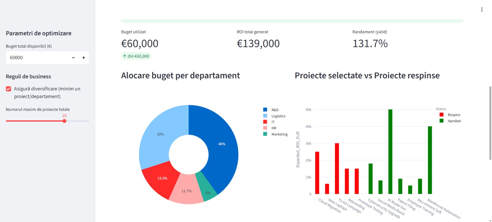
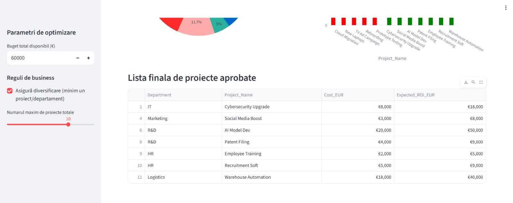

# Corporate capital budgeting optimizer

This project is a **Business Intelligence** application that utilizes **Integer Linear Programming (ILP)** to optimize the allocation of corporate investment budgets.

The system assists managers in selecting the ideal project portfolio to **maximize ROI (Return on Investment)**, while adhering to strict constraints regarding budget, resources and departmental strategy.

### Project evolution: from theory to business
This project represents my transition from academic mathematics to applied business solutions.

1.  **Academic origins:** the project started as university research where I applied the "Knapsack Problem" algorithm to optimize personal purchasing decisions under financial constraints.
2.  **Corporate adaptation:** I identified that the same mathematical model is widely used in **Project Portfolio Management (PPM)** within banking and multinational contexts. I completely refactored the cod to solve a real-world capital allocation problem.

---

### Tech Stack & Skills
* **Mathematics:** Operations Research, Integer Linear Programming (ILP), Optimization Algorithms.
* **Python libraries:** `PuLP` (Solver), `Pandas` (Data Manipulation), `Plotly` (Interactive Visualization).
* **Deployment:** `Streamlit` (Web Dashboard).

### Key features
* **Dynamic budgeting:** allows the simulation of different budget caps (What-If Analysis).
* **Strategic diversification:** the algorithm enforces the selection of at least one project per department (IT, HR, Marketing) to mitigate concentration risk.
* **ROI maximization:** the mathematical objective is strictly tied to maximizing profitability.

---

### Preview

